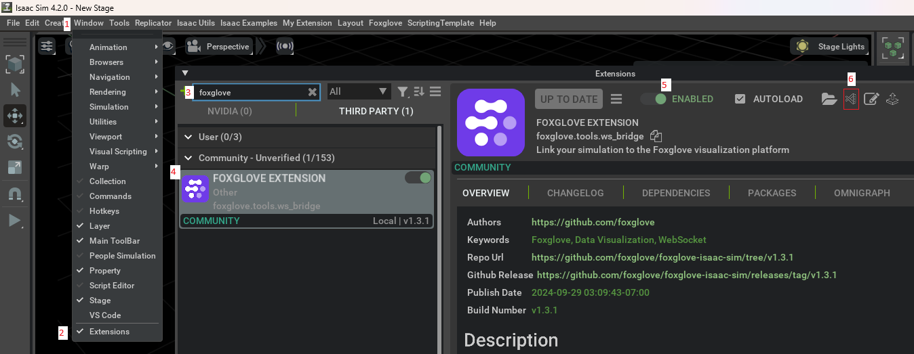

# Table of contents
- [Table of contents](#table-of-contents)
- [What is it](#what-is-it)
- [How it works](#how-it-works)
- [Running the application](#running-the-application)
	- [Testing environment](#testing-environment)
	- [Robot](#robot)
	- [Android](#android)
	- [Troubleshooting](#troubleshooting)
- [How the Isaac Sim scene was set up](#how-the-isaac-sim-scene-was-set-up)
- [Github Copilot usage](#github-copilot-usage)
	- [Robot](#robot-1)
	- [Android](#android-1)
	- [Most commonly used Copilot features](#most-commonly-used-copilot-features)

# What is it
A robot pick and place simulation built in Isaac Sim. Use an Android app to interact with the simulation using your natural language.

# How it works

- Isaac Sim robot simulation
	- Robot arm picks up items that enter the trigger zone and drops them off at the North and West bin drop zones alternatingly.
	- When an item is picked up from the trigger zone, a new item will spawn from the spawn point.
	- When an item falls into a bin, it publishes this to a message bus.
	- Robot arm pick and place
		- [Cortex framerwork](https://docs.omniverse.nvidia.com/isaacsim/latest/cortex_tutorials/tutorial_cortex_1_overview.html) decider network decides the next action to take based on the current state (basically like a decision tree). If the block is in the hand, it determines the next place to place the cube. If the cube slips out of its grasp, it'll try to regrab it. If the cube has been placed successfully, it'll look for the next target that is in the trigger zone to grab.
		- [RMPFlow motion generation](https://docs.omniverse.nvidia.com/isaacsim/latest/advanced_tutorials/tutorial_motion_generation_rmpflow.html) articulation helps to seamlessly move the end effector (the gripper) from point A to point B by figuring out how to move all the joints. Also used to open/close the gripper. It also performs obstacle avoidance for obstacles that I register in the scene.
- Isaac Sim extension Flask API server
	- Keeps track of items that have fallen into North & West bins by subscribing to a message bus. This information can be queried.
	- Can tell Isaac Sim to spawn a new cube, stop the robot, start the robot.
- Android app
	- Runs an Android app that connects to OpenAI realtime API and Azure avatar for natural language interaction. When a command is received by the user, it'll send the request to the Flask API server. The Azure avatar is used to act as an AI assistant. When talking to the Android app, the generated response text is forwarded to the Azure avatar to generate speech and human-like gestures in body, head, and lip sync.
	- Opens the Foxglove client in a web browser in split view for viewing live simulation data.
# Running the application
## Testing environment
- Windows 11 with RTX 3060Ti
- Isaac Sim v4.2.0
- Android Studio Ladybug
## Robot
1. Install Isaac Sim: https://docs.omniverse.nvidia.com/isaacsim/latest/installation/install_workstation.html.
2. Clone the repo into the Isaac Sim directory: `git clone https://github.com/RiskyFrisky/AIRobotAndApp.git`
	1. My Isaac Sim directory happens to be at `C:\Users\yourname\AppData\Local\ov\pkg\isaac-sim-4.2.0`
	2. NOTE: the reason for cloning inside of the Isaac Sim directory is so you can get the intellisense in the Python files.
3. Open `robot\kit-exts-project\exts\company.hello.world\company\hello\world\constants.py` and replace the `server_ip` with the IP of the machine you are running the simulation on.
4. Add the path to the custom extension
	1. Open `C:\Users\yourname\AppData\Local\ov\pkg\isaac-sim-4.2.0\exts\omni.isaac.kit\omni\isaac\kit\simulation_app.py`
	2. Add another path to `args` in `def _start_app(self) -> None:`
		1. Mine was `c:/users/yourname/appdata/local/ov/pkg/isaac-sim-4.2.0/airobotandapp/robot/kit-exts-project/exts`
5. Run the app from within the `robot/app` directory in Powershell.
```bash
Set-Alias -Name isaac_python -Value "C:\users\yourname\appdata\local\ov\pkg\isaac-sim-4.2.0\python.bat"
isaac_python -m pip install flask
isaac_python main.py
```
6. The first time you run the app, you'll need to install the Foxglove extension manually b/c it is an untrusted extension + you'll need to fix a bug
	1. Install the Foxglove extension
        1. 
      	2. On step 6 of the image, you'll need to open the extension in VSCode
	2. Open `foxglove/tools/ws_bridge/data_collection.py`
	3. In the class `DataCollector`, function `def add_sensor(self, prim : Prim, cam_width = 128, cam_height = 128, tf = False):`, add a try-catch block for this block of code
```python
if prim_type != "invalid":
	try:
		self.sensors[prim_path] = IsaacSensor(prim_type, prim_path, cam_width=cam_width, cam_height=cam_height)
		self.sensors_sorted[prim_type].add(prim_path)

		self.fox_wrap.add_channel(self.sensors[prim_path])

		return prim_type
	except Exception as e:
		print(f"An unexpected error occurred: {e}")
```
7. NOTE: The app should already be running, but each time you start the application you'll always need to restart it in order for the connection Foxglove to work.
## Android
1. Open the `android` project in Android Studio.
2. Open `Constants.kt` and replace the values.
	1. For the Azure speech credentials, you can create a speech resource through the Azure speech portal: https://learn.microsoft.com/en-us/azure/ai-services/speech-service/get-started-speech-to-text?tabs=windows%2Cterminal&pivots=ai-studio.
		1. NOTE: The Azure avatar only supports the regions listed here: https://learn.microsoft.com/en-us/azure/ai-services/speech-service/text-to-speech-avatar/what-is-text-to-speech-avatar#available-locations
	2. For the OpenAI key, you can create one by going to https://platform.openai.com/api-keys.
	3. For the constants that contain `<your_isaac_sim_machine_ip>`, replace that part with the IP of the machine where you will run the Isaac Sim application.
		1. NOTE: The Android app must run on the same network as the Isaac Sim machine in order for them to communicate.
3. Build and run the app on your Android device.
4. You will be prompted to allow mic recording. You must allow this.
## Troubleshooting
- If you install an extension in Isaac Sim, but removed it, this can prevent you from opening the extensions window anymore. To fix, open the user config which is printed at the beginning of the terminal when you launch Isaac Sim. Remove any lines that point to the removed extension directory. Then restart Isaac Sim.
	- My user config is `C:/Users/yourname/AppData/Local/ov/data/Kit/Isaac-Sim/4.2/user.config.json`
# How the Isaac Sim scene was set up
1. Conveyors were added by following this tutorial: https://docs.omniverse.nvidia.com/isaacsim/latest/features/warehouse_logistics/ext_omni_isaac_conveyor.html
	1. Conveyor speed set by changing velocity variable of conveyor action graph
	2. 
2. UR10 robot arm added like so
	1. NOTE: must be placed add origin (0, 0, 0)
	2. 
3. 2F-140 end effector added like so
	1. 
	2. Add a `TransformOp -> Transform, Orient, Scale` property and set position to match prim path `/World/Robot/UR10/ee_link`
      	1. 
	3. Add fixed physics joint by clicking on `/World/Robot/Robotiq_2F_140/robotiq_base_link /World/Robot/UR10/ee_link` and then `/World/Robot/UR10/ee_link` and right clicking to create the fixed physics joint.
		1. NOTE: the order of prims clicked matters.
      		1. 
		2. Ensure that `Exclude From Articulation` is unchecked
			1. 
4. Verify arm articulation is set up correctly
	1. Open the robot arm assembler
		1. 
	2. Run the sim & adjust the joint positions
		1. 
5. Add bins
	1. Add prims from SimReady Explorer
		1. 
	2. Add cubes as triggers
		1. 
		2. Add physics trigger
			1. 
		3. Added action graph to publish triggers to message bus
			1. 
# Github Copilot usage
- Code generation
- Code explanation
- Fixing bugs
- Code cleanup
- Documentation
## Robot
- Use copilot to explain & help merge the [Cortex Walkthrough: Franka Block Stacking](https://docs.omniverse.nvidia.com/isaacsim/latest/cortex_tutorials/tutorial_cortex_4_franka_block_stacking.html) and [Cortex Walkthrough: UR10 Bin Stacking](https://docs.omniverse.nvidia.com/isaacsim/latest/cortex_tutorials/tutorial_cortex_5_ur10_bin_stacking.html) examples which is the core of my simulation application. These example source codes can be found in the Isaac Sim installation path.
  - Decider networks: `C:\Users\yourname\AppData\Local\ov\pkg\isaac-sim-4.2.0\exts\omni.isaac.cortex.sample_behaviors\omni\isaac\cortex\sample_behaviors`
  - Franka block stacking sample app: `C:\Users\yourname\AppData\Local\ov\pkg\isaac-sim-4.2.0\extension_examples\franka_cortex`
  - UR10 (with suction cup) bin stacking sample app: `C:\Users\yourname\AppData\Local\ov\pkg\isaac-sim-4.2.0\extension_examples\ur10_palletizing`
- Helped to create Flask server used in custom Isaac extension
## Android
- Converted Azure avatar Java example https://github.com/Azure-Samples/cognitive-services-speech-sdk/tree/master/samples/java/android/avatar to Kotlin Jetpack Compose.
- Help generate code for websocket communication needed to connect with OpenAI realtime API
- Autocomplete Jetpack Compose UI
- Used to try to embed website in a Compose webview (ultimately didn't end up using this option though)
## Most commonly used Copilot features
- Android Studio & VSCode
	- Copilot chat
	- Code autocompletion
	- `Ctrl i` to query/modify code for selection
- VSCode chat commands
	- `@workspace`
		- gets context from entire codebase when answering questions
	- `#file`
		- gets context from selected files when answering questions
	- `#selection`
		- gets context from selections when answering questions
	- `@askstackoverflow`
		- a [Github Copilot extension](https://github.com/marketplace/stack-overflow-extension-for-github-copilot) that users knowledge from StackOverflow when answering questions
	- VSCode "Edit with Copilot"
		- Preview feature that modifies code for you. Used this primarily for learning about Isaac Sim OpenUSD tutorials, and Isaac Sim sample extensions, modifying Cortex examples, and modifying my own code.
- [Copilot command line](https://docs.github.com/en/copilot/using-github-copilot/using-github-copilot-in-the-command-line)
	- Used occasionally when to explain errors that occur in the command line
	- `gh copilot explain "..."`
